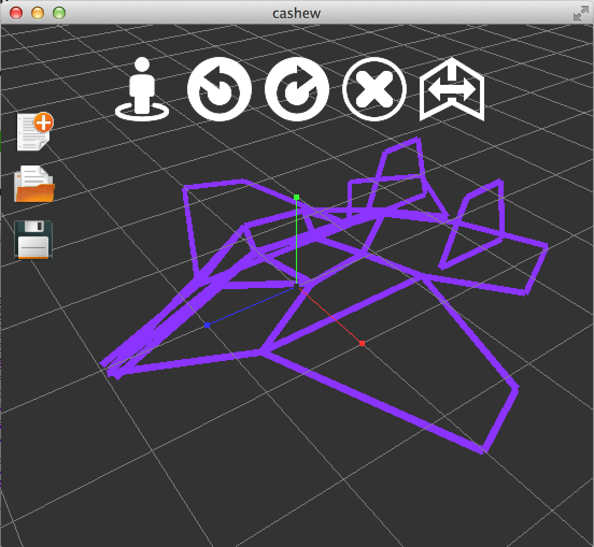

Cashew
========

[](https://travis-ci.org/billhsu/cashew)
[](https://gitter.im/billhsu/cashew?utm_source=badge&utm_medium=badge&utm_campaign=pr-badge)

Freestyle 3D sketching app.  
The only limit is your imagination.  

Website: [http://billhsu.github.io/cashew](http://billhsu.github.io/cashew)  
Demo Video: On [YouTube](https://www.youtube.com/watch?v=kX9W6WuJf5U), or on [优酷](http://v.youku.com/v_show/id_XMTQ0NzcwODQwOA==.html)

<a href="http://billhsu.github.io/cashew"></a>

## Install
1. Download latest version of cashew from: [https://github.com/billhsu/cashew/releases/download/v1.0/cashew.dmg](https://github.com/billhsu/cashew/releases/download/v1.0/cashew.dmg)
2. Open `cashew.dmg` and drag `cashew.app` to `Applications`

## Usage
### File
<p>Create a new sketch file</p>
<p>Open a sketch file</p>
<p>Save the current sketch file</p>

### Operations
<p>Reset camera to recommended angle</p>
<p>Translate camera position</p>
<p>Toggle between drawing straight lines or free drawing</p>
<p>Undo last operation</p>
<p>Redo last operation</p>
<p>Delete lines</p>
<p>Select mirror mode</p>


## Build
### With command line(Mac OS)
```shell
./configure && make
xctool -project Xcode/cashew/cashew.xcodeproj -scheme cashew build;
```
### With Xcode
1. ```./configure && make```
2. Open Xcode/cashew/cashew.xcodeproj with Xcode

## Author
**Shipeng Xu**

+ http://BillHsu.me
+ http://twitter.com/1991bill
+ http://weibo.com/billhsu
